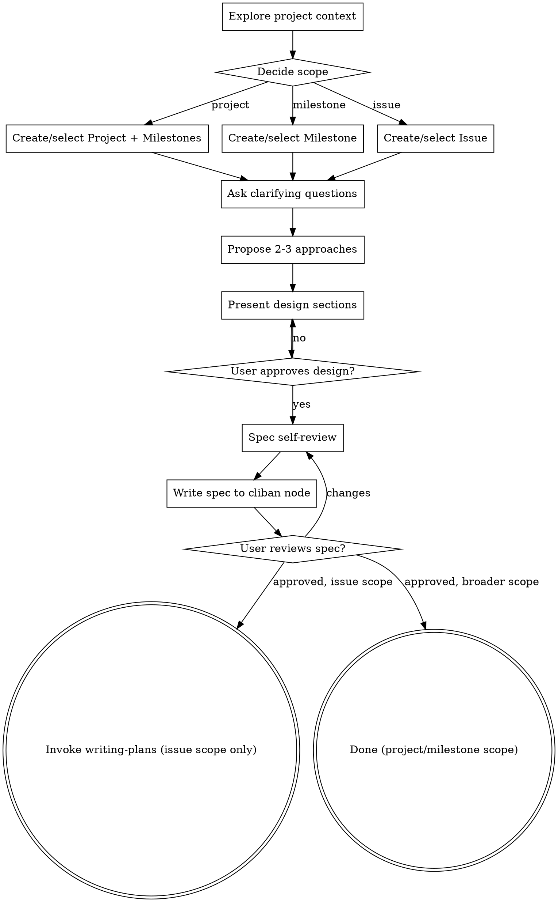
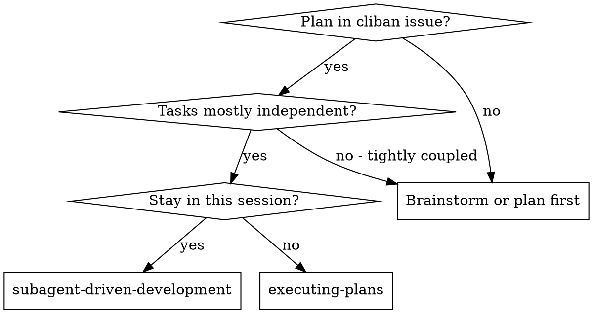

# Cliban Skill-Suite Refactor Implementation Plan

> **For agentic workers:** REQUIRED SUB-SKILL: Use superpowers:subagent-driven-development (recommended) or superpowers:executing-plans to implement this plan task-by-task. Steps use checkbox (`- [ ]`) syntax for tracking.

**Goal:** Move the spec/plan/activity workflow out of project repos and into cliban by rewriting eight skills, adding a new `cliban-workflow` convention layer, retiring the Linear integration, and validating the chain with an end-to-end golden-path test.

**Architecture:** A new `skills/cliban-workflow/SKILL.md` is the only place where cliban command vocabulary, status mapping, and the parseable-description contract live. Rewritten skills declare `requires_skills: [cliban-workflow]` and call cliban commands by their stable JSON shapes. The Linear integration skill is deleted; three skills (`bugs`, `session-end`, `ticket`) swap their `linear-integration` requirement for `cliban-workflow`.

**Tech Stack:** Plain markdown (skill files). Cliban CLI (binary already installed via Plan A: `cliban project ls --json`, `cliban issue tick`, `cliban issue log`, `cliban issue promote`, etc.). No Go code, no automated tests — verification is by reading each rewritten file and exercising the referenced cliban commands.

**Working directory:** `/home/alex/dev/alex-memory`. All paths relative to that root unless absolute.

**Background spec:** [[2026-05-20-cliban-driven-workflow-design]] §"Per-Skill Behavior Changes" and §"The `cliban-workflow` Convention Layer".

**Plan A dependency:** Plan A (`docs/superpowers/plans/2026-05-20-cliban-extensions.md`) shipped as commit `697be7d` on cliban's main. All cliban commands referenced below exist. Verify with `cliban issue tick --help` before starting.

---

## File Structure

| Path | Role |
|---|---|
| `skills/cliban-workflow/SKILL.md` | **NEW.** Convention layer — cliban command vocabulary, status mapping, description contract, graceful degradation. |
| `skills/brainstorming/SKILL.md` | **MAJOR REWRITE.** Removes spec-file writes; adds scope detection (project/milestone/issue) and cliban node creation. |
| `skills/writing-plans/SKILL.md` | **MAJOR REWRITE.** Operates on a cliban Issue key; reads spec via `--section spec`; writes Plan section to issue description. |
| `skills/executing-plans/SKILL.md` | **MAJOR REWRITE.** Walks cliban Plan via `cliban issue tick`/`log`/`promote`; moves issue status. |
| `skills/subagent-driven-development/SKILL.md` | **MAJOR REWRITE.** Same as executing-plans but per-task subagent dispatch. |
| `skills/ticket/SKILL.md` | **REWRITE.** Drops Linear; creates a cliban Issue through the existing 3-phase conversation. |
| `skills/bugs/SKILL.md` | **REWRITE.** `/bugs add` → cliban Issue with `--label bug` + optional memory entry; `/bugs resolve` → `cliban issue mv done`. |
| `skills/status/SKILL.md` | **REWRITE.** Replaces memory-API queries with `cliban project ls` + `cliban issue ls`. |
| `skills/finishing-a-development-branch/SKILL.md` | **UPDATE.** Adds cliban issue status transitions on PR open, merge, discard. |
| `skills/session-end/SKILL.md` | **SMALL UPDATE.** Adds a "Cliban activity" section using `cliban issue ls --updated-since`. |
| `skills/linear-integration/SKILL.md` | **DELETE.** Entire skill folder removed. |
| `.claude/settings.json` (optional) | **EDIT.** Strip `LINEAR_TEAM` / `LINEAR_PROJECT` env vars if present. |

---

## Conventions for All Tasks

- **Verification by reading + cliban probing.** Each task ends with a structural check (`head -1` on the new file to confirm frontmatter, grep for required tokens) and a cliban command probe (e.g., `cliban issue tick --help`) to confirm the skill's referenced commands exist.
- **No mass deletes of doc files.** `docs/superpowers/specs/*.md` and `docs/superpowers/plans/*.md` remain as historical artifacts. The skill content stops *writing* to those directories; existing files are left alone.
- **Commit message style.** Use the existing repo convention: `<type>(scope): subject`. Examples: `feat(skills): ...`, `refactor(skills): ...`, `chore(skills): ...`.

---

## Task 1: Create `cliban-workflow` convention layer

**Files:**
- Create: `skills/cliban-workflow/SKILL.md`

- [ ] **Step 1: Create the skill directory and file**

```bash
mkdir -p /home/alex/dev/alex-memory/skills/cliban-workflow
```

- [ ] **Step 2: Write the convention layer**

`skills/cliban-workflow/SKILL.md`:
````markdown
---
name: cliban-workflow
description: "Convention layer for cliban-based workflow management. Loaded by workflow skills via requires_skills to provide cliban command vocabulary, status mapping, and the parseable-description contract."
---

# Cliban Workflow — Convention Layer

This skill is loaded automatically by workflow skills that declare `requires_skills: [cliban-workflow]`. It teaches when and how to use the cliban CLI for the brainstorm → plan → execute → finish workflow.

## Detection and Graceful Degradation

Before performing ANY cliban action, check availability:

1. **Probe `cliban --version`.** If the command is not on `$PATH`, skip all cliban actions silently for this session. Do not warn, do not suggest install, do not block the workflow.
2. **If the probe succeeds, attempt the first real cliban call.** If it fails (DB missing, schema mismatch, exit 3), surface the error once with `"cliban error: <message> — try 'cliban init' or check $CLIBAN_DB"` and then skip remaining cliban actions this session. Do not retry.

<IMPORTANT>
Cliban integration is REQUIRED for the new workflow but the SKILLS must still function for users who haven't installed cliban yet. Workflow skills fall back to local-file behavior only if explicitly directed; otherwise they error clearly with the cliban setup instruction above.
</IMPORTANT>

## Vocabulary

Cliban's primitives are:

- **Project** — top-level scope. Identified by uppercase key (e.g. `SHH`, `COOK`).
- **Milestone** — bundle of issues. Named per project, optional target date.
- **Issue** — body of work. Key shape: `{PROJECT}-{N}` (e.g. `SHH-12`).
- **Sub-issue** — depth-limited to 2. Use `--parent KEY` on `issue add`.
- **Labels** — free-form per project (auto-created on first use).
- **Relations** — `blocks`, `blocked_by`, `related_to` (symmetric).

## Status Mapping

| Workflow event | Cliban status |
|---|---|
| Plan written | `backlog` |
| First step picked up | `in-progress` |
| Stuck on dependency | `blocked` |
| PR opened | `in-review` |
| PR merged / local merge | `done` |
| Discarded / abandoned | keep current status, append log entry |

## Active-Project Resolution

When a workflow skill needs a project context:

1. Try `basename $(git rev-parse --show-toplevel)` and match (case-insensitive) against `cliban project ls --json` results (both `key` and `name`).
2. If no match, list projects and ask the user which one — or whether to create a new project.

```bash
REPO=$(basename "$(git rev-parse --show-toplevel)" 2>/dev/null | tr '[:lower:]' '[:upper:]')
cliban project ls --json | jq --arg r "$REPO" 'select(.key==$r or (.name|ascii_upcase)==$r)'
```

## Active-Issue Resolution

When a workflow skill needs the current issue:

1. Try `cliban issue current --json` (reads current git branch, parses the cliban-style prefix).
2. If exit code 1, ask the user for the issue KEY.

## Parseable-Description Contract

Issue (and milestone/project) descriptions follow a strict markdown contract that several cliban commands parse:

```markdown
## Spec

[brainstorming output — free-form markdown]

## Plan

### Task 1: short name
**Files:** ...

- [ ] **Step 1: ...**
- [ ] **Step 2: ...**

### Task 2: short name
...

## Activity Log

- 2026-05-20T13:42Z — chronological entry
- 2026-05-21T09:15Z — another entry

## Notes

[long-lived notes, mostly on project descriptions]
```

Binding conventions:

1. Top-level anchors: `## Spec`, `## Plan`, `## Activity Log`, `## Notes`. Exact-match.
2. Plan tasks: H3 `### Task <N>: <name>`. Numbered uniquely.
3. Plan steps: GFM checkbox lines at column zero (`- [ ] ...` or `- [x] ...`). Indented child bullets are NOT steps.
4. Promotion suffix: a step pointing to a separate issue is rewritten as `- [ ] Step 3: CSRF middleware → SHH-18`.
5. Strict failure: structural violations exit with code 2 — fix the description and retry, no best-effort recovery.

## Mutation Commands (atomic via SQLite)

```bash
# Read one section without round-tripping the whole description:
cliban issue show KEY --section spec|plan|activity|notes

# Atomically flip a plan step's checkbox:
cliban issue tick KEY --task N --step M --json

# Atomically append a timestamped Activity Log entry:
cliban issue log KEY "<message>" --json
cliban issue log KEY --message-file - --json  # stdin

# Promote a step into its own issue and rewrite the step line:
cliban issue promote KEY --task N --step M --title "..." --as sub-issue|related --json
```

Each of these runs in a single SQL transaction. Concurrent calls are serialized.

## Cross-Project Conventions

- **Canonical labels** for `--label`: `bug`, `feature`, `refactor`, `chore`. Cliban auto-creates labels on `issue add --label`; do not pre-create. Orphan labels are not garbage-collected, so prefer the canonical set.
- **Default priority** on issue creation: `medium`. Use `high` / `urgent` only when explicitly indicated.
- **Relations:** use `--blocks` / `--blocked-by` for hard dependencies, `--related-to` for soft references.
- **Promotion-mirror responsibility:** when a promoted child issue moves to `done`, the workflow skill that did the move is responsible for also calling `cliban issue tick` on the referencing step in the parent. Cliban core does NOT auto-mirror — this is the skill's job, deliberately kept out of cliban to avoid coupling the core to the description-parsing contract.

## Workflow Actions by Skill

### Brainstorming
- Detect active project (above)
- Ask scope: project / milestone / issue
- Create the appropriate node with the `## Spec` section in its description

### Writing-plans
- Take or infer an Issue key
- Read spec: `cliban issue show KEY --section spec`
- Write plan via `cliban issue edit KEY --description-file -` (round-trips full description preserving Spec + Activity Log)

### Executing-plans / Subagent-driven-development
- `cliban issue mv KEY in-progress`
- For each step: execute → `cliban issue tick KEY --task N --step M`
- For bugs: `cliban issue add --label bug --blocks KEY` + `cliban issue log KEY "bug surfaced: NEWKEY"`
- For oversized steps: `cliban issue promote KEY --task N --step M --title "..." --as sub-issue`

### Ticket
- `cliban issue add --project KEY --title "..." --priority ...`

### Bugs
- Add: `cliban issue add --label bug --priority ...`
- List: `cliban issue ls --label bug --json`
- Resolve: `cliban issue mv KEY done`

### Status
- `cliban project ls --json`
- `cliban issue ls --status in-progress --json`
- `cliban issue blocked --json`

### Finishing-a-development-branch
- PR opened: `cliban issue mv KEY in-review` + `cliban issue log KEY "PR opened: <url>"`
- Local merge: `cliban issue mv KEY done`
- Discard: `cliban issue log KEY "work discarded"` (keep current status)

### Session-end
- `cliban issue ls --updated-since <session-start> --json` → summarize as a "Cliban activity" section

## What NOT to Do

- Don't parse the human table output of `ls`/`show`. Always use `--json`.
- Don't nest sub-issues three levels deep — cliban exits 2 (use `related_to` instead).
- Don't mutate the structured sections (`## Plan`, `## Activity Log`) outside of `tick`/`promote`/`log`. Hand-editing breaks the contract and the next mutation command exits 2.
- Don't pre-create labels — `issue add --label X` auto-creates.
- Don't pass `--editor` in an agent context — exits 2 without a TTY.
- Don't write spec or plan content to `docs/superpowers/specs/` or `docs/superpowers/plans/` in project repos. Those locations are deprecated under the new workflow.
````

- [ ] **Step 3: Verify the file exists and parses**

```bash
head -5 /home/alex/dev/alex-memory/skills/cliban-workflow/SKILL.md
grep -c "^## " /home/alex/dev/alex-memory/skills/cliban-workflow/SKILL.md
```

Expected: first 5 lines show frontmatter, at least 9 H2 sections present.

- [ ] **Step 4: Probe that all referenced cliban commands exist**

```bash
cliban --version >/dev/null && \
cliban issue tick --help >/dev/null && \
cliban issue log --help >/dev/null && \
cliban issue promote --help >/dev/null && \
cliban issue current --help >/dev/null && \
cliban issue show --help | grep -q -- "--section" && \
cliban issue ls --help | grep -q -- "--updated-since" && \
cliban milestone add --help | grep -q -- "--description-file" && \
echo "all commands present"
```

Expected: `all commands present`.

- [ ] **Step 5: Commit**

```bash
cd /home/alex/dev/alex-memory
git add skills/cliban-workflow/SKILL.md
git commit -m "feat(skills): add cliban-workflow convention layer"
```

---

## Task 2: Rewrite `ticket` skill

**Files:**
- Modify: `skills/ticket/SKILL.md`

- [ ] **Step 1: Replace the file contents**

`skills/ticket/SKILL.md`:
````markdown
---
name: ticket
description: "Create a cliban issue through conversation. Use when user invokes /ticket to brainstorm and create a well-formed cliban issue."
requires_skills: [cliban-workflow]
---

# Ticket — Create a Cliban Issue

Create a well-formed cliban issue through natural conversation. Starts quick, goes deeper if the topic warrants it.

## Prerequisites

Cliban must be on `$PATH`. The `cliban-workflow` skill handles detection and graceful degradation.

## The Process

### Phase 1: Quick Understanding (2-3 questions)

1. **What are you building/fixing?** — get the core idea in one sentence
2. **What type of work is this?** — feature, bug, refactor, chore (suggest based on description)
3. **How urgent is this?** — map to cliban priority (default `medium`)

Resolve the active project via the convention layer (basename match → fallback to user prompt).

After these questions, draft a ticket:

```
Project: <PROJECT-KEY>
Title: <imperative, concise>
Type: <feature|bug|refactor|chore>  → label
Priority: <none|low|medium|high|urgent>
Description: <2-3 sentences from what you've learned>
```

Ask: **"Does this capture it, or should we dig deeper?"**

### Phase 2: Go Deeper (if needed)

If the user wants more detail, ask follow-up questions **one at a time**:

- What does success look like? (acceptance criteria — these go in the `## Spec` section)
- What context would help someone picking this up? (background, constraints)
- Are there dependencies or blockers? (use `--blocked-by KEY` or `--blocks KEY`)
- Which milestone should this attach to? (use `--milestone NAME`)

Update the draft with a richer description.

### Phase 3: Create the Ticket

Once the user approves the draft, create the issue via stdin so the description can be multi-line:

```bash
cliban issue add --project <KEY> \
  --title "<title>" \
  --priority <priority> \
  --label <type> \
  [--milestone "<name>"] \
  [--blocked-by KEY] \
  [--blocks KEY] \
  --description-file - --json <<'EOF'
## Spec

<description body — at least the core idea; add acceptance criteria if Phase 2 was used>
EOF
```

If the user specified a parent (e.g., "this is under SHH-10"), add `--parent SHH-10` instead of (or in addition to) `--milestone`.

Report the created key, title, and git branch name from the JSON response:

```
Created <KEY>: <title>
Priority: <priority> | Project: <project>
Branch: <git_branch_name>
```

### Creating Sub-Tickets

If the user says "under SHH-10" or "child of SHH-10", pass `--parent SHH-10`. Cliban caps depth at 2 — if the target parent is already a sub-issue, fall back to `--related-to SHH-10` instead and explain why.

## Output

After creation, show exactly:

```
Created <KEY>: <title>
Priority: <priority> | Project: <project>
Branch: <git_branch_name>
```

If it's a sub-ticket, also show: `Parent: <PARENT-KEY>`.
````

- [ ] **Step 2: Verify frontmatter and structure**

```bash
head -5 /home/alex/dev/alex-memory/skills/ticket/SKILL.md
grep -q "requires_skills: \[cliban-workflow\]" /home/alex/dev/alex-memory/skills/ticket/SKILL.md && echo "ok"
grep -qv "LINEAR" /home/alex/dev/alex-memory/skills/ticket/SKILL.md && echo "no Linear references"
```

Expected: both `ok` and `no Linear references` printed.

- [ ] **Step 3: Probe cliban commands referenced**

```bash
cliban issue add --help | grep -q -- "--description-file" && \
cliban issue add --help | grep -q -- "--label" && \
cliban issue add --help | grep -q -- "--blocked-by" && \
echo "ticket commands available"
```

Expected: `ticket commands available`.

- [ ] **Step 4: Commit**

```bash
git add skills/ticket/SKILL.md
git commit -m "refactor(ticket): replace Linear backend with cliban"
```

---

## Task 3: Rewrite `status` skill

**Files:**
- Modify: `skills/status/SKILL.md`

- [ ] **Step 1: Replace the file contents**

`skills/status/SKILL.md`:
````markdown
---
name: status
description: "Project progress tracking via cliban. Use when user invokes /status to see active projects or project details."
requires_skills: [cliban-workflow]
---

# Status — Project Progress

Show cliban project progress. Replaces the older memory-API-backed implementation.

## Subcommands

### `/status` (no args)

List all active projects with progress counts:

```bash
cliban project ls --json
```

For each project, also fetch issue counts per status:

```bash
for status in backlog in-progress blocked in-review done; do
  count=$(cliban issue ls --project <KEY> --status "$status" --json | wc -l)
  echo "  $status: $count"
done
```

Aggregate into one summary per project. Skip the `done` count if the project has auto-archive enabled (it'll always be small).

### `/status <project>`

Show details for a specific project (case-insensitive match against `key` or `name`):

```bash
# Resolve project key
TARGET="<PROJECT_INPUT>"
KEY=$(cliban project ls --json | jq -r --arg t "$TARGET" \
  'select((.key|ascii_upcase) == ($t|ascii_upcase) or (.name|ascii_upcase) == ($t|ascii_upcase)) | .key' | head -1)

# Fetch project + active issues
cliban project ls --json | jq --arg k "$KEY" 'select(.key == $k)'
cliban issue ls --project "$KEY" --status in-progress --json
cliban issue ls --project "$KEY" --status blocked --json
cliban milestone ls --project "$KEY" --json
```

### `/status blocked`

Cross-project view of issues with open blockers:

```bash
cliban issue blocked --json
```

## Output Format

For project list (`/status`):

```
<KEY>  <Name>
  backlog:     <n>
  in-progress: <n>
  blocked:     <n>
  in-review:   <n>
  (done counts skipped when auto-archive enabled)
```

For a single project (`/status <project>`):

```
<KEY> — <Name>
<description first line, if present>

Active milestones:
  <name>  target: YYYY-MM-DD  issues: <n>

In progress:
  <KEY-N>  <title>  (priority)
  ...

Blocked:
  <KEY-N>  <title>  blocked by: <KEY-M>
  ...
```

For `/status blocked`:

```
Blocked issues (across all projects):
  <KEY-N>  <title>  blocked by: <KEY-M>  (priority)
  ...
```

## Notes

- All reads use `--json`. Never parse the table output.
- Done issues are excluded by default (use `--archived` to include archived items if specifically asked).
- The previous version stored project memories in an external API; that backing store is no longer queried. Project state lives in cliban.
````

- [ ] **Step 2: Verify structure**

```bash
head -5 /home/alex/dev/alex-memory/skills/status/SKILL.md
grep -q "requires_skills: \[cliban-workflow\]" /home/alex/dev/alex-memory/skills/status/SKILL.md && echo "ok"
grep -qv "MEMORY_API_URL" /home/alex/dev/alex-memory/skills/status/SKILL.md && echo "no memory API references"
```

Expected: `ok` and `no memory API references`.

- [ ] **Step 3: Probe cliban commands referenced**

```bash
cliban project ls --json >/dev/null && \
cliban issue blocked --help >/dev/null && \
cliban milestone ls --help >/dev/null && \
echo "status commands available"
```

Expected: `status commands available`.

- [ ] **Step 4: Commit**

```bash
git add skills/status/SKILL.md
git commit -m "refactor(status): query cliban instead of memory API"
```

---

## Task 4: Rewrite `brainstorming` skill

**Files:**
- Modify: `skills/brainstorming/SKILL.md`

- [ ] **Step 1: Replace the file contents**

`skills/brainstorming/SKILL.md`:
````markdown
---
name: brainstorming
description: "You MUST use this before any creative work - creating features, building components, adding functionality, or modifying behavior. Explores user intent, requirements and design before implementation, with the resulting spec stored in cliban."
requires_skills: [cliban-workflow]
---

# Brainstorming Ideas Into Designs

Help turn ideas into fully formed designs and specs through natural collaborative dialogue. The resulting spec is stored in a cliban node (project / milestone / issue) — NOT in a file under `docs/superpowers/specs/`.

<HARD-GATE>
Do NOT invoke any implementation skill, write any code, scaffold any project, or take any implementation action until you have presented a design and the user has approved it. This applies to EVERY project regardless of perceived simplicity.
</HARD-GATE>

## Anti-Pattern: "This Is Too Simple To Need A Design"

Every project goes through this process. A todo list, a single-function utility, a config change — all of them. The design can be short (a few sentences for truly simple projects), but you MUST present it and get approval.

## Checklist

You MUST create a task for each of these items and complete them in order:

1. **Explore project context** — `cliban project ls --json`, recent commits, existing related issues
2. **Decide brainstorm scope** — project-level / milestone-level / issue-level
3. **Offer visual companion** (if topic will involve visual questions) — own message, no other content
4. **Ask clarifying questions** — one at a time
5. **Propose 2-3 approaches** — with trade-offs and a recommendation
6. **Present design** — in sections scaled to complexity, get approval after each
7. **Spec self-review** — placeholders / contradictions / ambiguity / scope
8. **Write the spec to the cliban node** (Project description / Milestone description / Issue description)
9. **User reviews stored spec** before transitioning to implementation
10. **Transition** — invoke writing-plans skill (for issue-scoped) or hand back to user (for project/milestone scoped — they'll create issues under it later)

## Process Flow



## Deciding Scope

Ask early in the conversation:

> "This sounds like:
> - **Project-level** — a new product, a major architectural direction
> - **Milestone-level** — a release, an epic, a themed bundle of issues
> - **Issue-level** — a single feature or body of work
>
> Which fits?"

Branch the rest of the conversation on the answer. If unclear, the user picks — don't auto-decide.

## Scope: Project-Level

1. Confirm project name/key with user (e.g., `SHH` for shh secret manager).
2. If new, create: `cliban project add <KEY> --name "<Name>" --description "<one-line summary>"`.
3. Run the rest of the brainstorm (questions → approaches → design sections) to draft an architecture-level spec.
4. After approval, write the `## Spec` (and optionally `## Notes`) to the project description:

```bash
cliban project edit <KEY> --description-file - <<'EOF'
## Spec

<design content with H3 subsections — architecture, vision, constraints>

## Notes

<longer-lived notes that outlive any single milestone>
EOF
```

5. Offer to create initial milestones under the new project:

> "Should I create milestones for the phases we discussed?"

If yes, repeat the milestone flow below for each.

6. Hand-off: this brainstorm is complete. Next step is per-milestone or per-issue brainstorming as the user picks them up. Do NOT invoke writing-plans (no single issue to plan yet).

## Scope: Milestone-Level

1. Resolve the active project (convention layer).
2. Ask milestone name and optional target date.
3. Run questions → approaches → design.
4. After approval, write the spec to the milestone description:

```bash
cliban milestone add --project <KEY> --name "<NAME>" [--target YYYY-MM-DD] \
  --description-file - <<'EOF'
## Spec

<what this milestone delivers, why, scope, non-goals>
EOF
```

5. Offer to create kickoff issues:

> "Should I create initial issues under milestone <NAME>?"

If yes, repeat the issue flow below for each. (Or hand off to /ticket.)

6. Hand-off: brainstorm complete. No writing-plans call at milestone scope.

## Scope: Issue-Level

1. Resolve the active project.
2. Run questions → approaches → design sections.
3. After approval, create the issue:

```bash
cliban issue add --project <KEY> --title "<title>" \
  --priority medium --label <type> \
  [--milestone "<name>"] [--parent <KEY-N>] \
  --description-file - --json <<'EOF'
## Spec

<spec body with whatever subsections are useful>
EOF
```

4. Spec self-review (inline checks).
5. Tell the user: `"Spec written to <NEWKEY>. Please review it with `cliban issue show <NEWKEY> --section spec --pager` and let me know if anything needs changes before we write the implementation plan."`
6. Wait for approval. If changes are requested, edit the spec:

```bash
cliban issue edit <NEWKEY> --description-file - <<'EOF'
<full new description, preserving ## Plan and ## Activity Log if they exist>
EOF
```

7. **Transition:** invoke the `writing-plans` skill with the issue key.

## Clarifying Questions

- Check existing project state (recent issues, milestones, prior brainstorms via `cliban issue ls --project KEY`)
- Search for related work: `cliban issue ls --project KEY --label <type> --json | jq 'select(.title | contains("<keyword>"))'`
- Surface any existing tickets that touch the same area before brainstorming new work

## Exploring Approaches

- Propose 2-3 different approaches with trade-offs
- Present options conversationally with your recommendation and reasoning
- Lead with your recommended option and explain why

## Presenting the Design

- Scale each section to its complexity: a few sentences if straightforward, up to 200-300 words if nuanced
- Ask after each section whether it looks right so far
- Cover: architecture, components, data flow, error handling, testing
- Be ready to go back and clarify

## Spec Self-Review

After drafting the design content (but before writing to cliban):

1. **Placeholder scan:** Any "TBD", "TODO", incomplete sections, or vague requirements?
2. **Internal consistency:** Do sections contradict? Does the architecture match the feature descriptions?
3. **Scope check:** Focused enough for one body of work, or does it need decomposition? If issue-scoped and the spec covers multiple independent subsystems, decompose into multiple sibling issues.
4. **Ambiguity check:** Could anything be interpreted two ways?

Fix inline. No need to re-review — just fix and move on.

## Visual Companion

A browser-based companion for showing mockups, diagrams, and visual options. Available as a tool — not a mode.

**Offering the companion:** When you anticipate visual content, offer once for consent:
> "Some of what we're working on might be easier to explain if I can show it to you in a web browser. I can put together mockups, diagrams, comparisons, and other visuals as we go. This feature is still new and can be token-intensive. Want to try it? (Requires opening a local URL)"

**This offer MUST be its own message.** Do not combine with clarifying questions. Wait for response.

**Per-question decision:** Decide for each question whether the browser or terminal is better. Use the browser ONLY for content that IS visual (mockups, layouts, diagrams). Use the terminal for text content (requirements, tradeoffs, A/B/C/D text options).

If they accept, read the detailed guide: `skills/brainstorming/visual-companion.md`.

## Key Principles

- **One question at a time** — don't overwhelm
- **Multiple choice preferred** — easier to answer
- **YAGNI ruthlessly** — remove unnecessary features
- **Explore alternatives** — always 2-3 approaches
- **Incremental validation** — present design, get approval section by section
- **Be flexible** — go back and clarify when something doesn't make sense

## Anti-Patterns

- **DO NOT** write `docs/superpowers/specs/*.md`. The spec lives in cliban.
- **DO NOT** commit a spec file to the project repo as part of brainstorming. The project repo stays code-only.
- **DO NOT** invoke writing-plans for project- or milestone-scoped brainstorms — those don't have a single issue to plan.
````

- [ ] **Step 2: Verify structure**

```bash
head -5 /home/alex/dev/alex-memory/skills/brainstorming/SKILL.md
grep -q "requires_skills: \[cliban-workflow\]" /home/alex/dev/alex-memory/skills/brainstorming/SKILL.md && echo "ok"
grep -qv "docs/superpowers/specs" /home/alex/dev/alex-memory/skills/brainstorming/SKILL.md && echo "no spec-file writes"
grep -q "cliban issue add" /home/alex/dev/alex-memory/skills/brainstorming/SKILL.md && echo "issue creation present"
grep -q "cliban milestone add" /home/alex/dev/alex-memory/skills/brainstorming/SKILL.md && echo "milestone creation present"
grep -q "cliban project add" /home/alex/dev/alex-memory/skills/brainstorming/SKILL.md && echo "project creation present"
```

Expected: all four `ok`/`present` messages plus `no spec-file writes`.

- [ ] **Step 3: Probe cliban commands**

```bash
cliban project add --help >/dev/null && \
cliban milestone add --help >/dev/null && \
cliban issue add --help >/dev/null && \
cliban project edit --help >/dev/null && \
cliban issue edit --help | grep -q -- "--description-file" && \
echo "brainstorming commands available"
```

Expected: `brainstorming commands available`.

- [ ] **Step 4: Visual-companion guide is still referenced**

```bash
ls /home/alex/dev/alex-memory/skills/brainstorming/visual-companion.md && echo "visual companion preserved"
```

Expected: `visual companion preserved` (the file is untouched by this task).

- [ ] **Step 5: Commit**

```bash
git add skills/brainstorming/SKILL.md
git commit -m "refactor(brainstorming): store specs in cliban nodes instead of files"
```

---

## Task 5: Rewrite `writing-plans` skill

**Files:**
- Modify: `skills/writing-plans/SKILL.md`

- [ ] **Step 1: Replace the file contents**

`skills/writing-plans/SKILL.md`:
````markdown
---
name: writing-plans
description: "Use when you have a spec for a multi-step task, before touching code. Writes the implementation plan into the corresponding cliban issue's ## Plan section."
requires_skills: [cliban-workflow]
---

# Writing Plans

## Overview

Write comprehensive implementation plans assuming the engineer has zero context for our codebase and questionable taste. Document everything they need to know: which files to touch, code, testing, docs they might need to check, how to test it. Give them the whole plan as bite-sized tasks. DRY. YAGNI. TDD. Frequent commits.

Assume they are a skilled developer, but know almost nothing about our toolset or problem domain. Assume they don't know good test design very well.

**The plan is written into the cliban Issue's `## Plan` section** — NOT to a markdown file in `docs/superpowers/plans/`.

**Announce at start:** "I'm using the writing-plans skill to create the implementation plan."

## Inputs

This skill operates on a single cliban Issue. Resolve the key in this order:

1. Argument passed by the invoking skill (typically the brainstorming hand-off)
2. `cliban issue current --json` (current git branch)
3. Ask the user

Then read the spec:

```bash
cliban issue show <KEY> --section spec
```

If there is no `## Spec` section, ask the user to run brainstorming first, or ask them to paste the spec content so you can populate it.

## Scope Check

If the spec covers multiple independent subsystems, it should have been broken into sibling issues during brainstorming. If it wasn't, suggest stopping and decomposing — each plan should produce working, testable software on its own.

For substantial multi-phase work, suggest creating sibling issues (via /ticket or by editing the milestone). Don't write a 50-task plan on one issue.

## File Structure (in the codebase)

Before defining tasks, map out which files in the target project repo will be created or modified and what each one is responsible for. This is where decomposition decisions get locked in.

- Design units with clear boundaries and well-defined interfaces. Each file should have one clear responsibility.
- Files that change together should live together. Split by responsibility, not by technical layer.
- In existing codebases, follow established patterns. If a file you're modifying has grown unwieldy, including a split in the plan is reasonable — but don't propose unrelated refactoring.

This structure informs the task decomposition. Each task should produce self-contained changes that make sense independently.

## Bite-Sized Task Granularity

**Each step is one action (2-5 minutes):**
- "Write the failing test" — step
- "Run it to make sure it fails" — step
- "Implement the minimal code to make the test pass" — step
- "Run the tests and make sure they pass" — step
- "Commit" — step

## Plan Structure Inside the Issue Description

The full description after writing-plans should look like:

```markdown
## Spec

<existing spec content from brainstorming>

## Plan

### Task 1: <component name>

**Files:**
- Create: `exact/path/to/file.py`
- Modify: `exact/path/to/existing.py:123-145`
- Test: `tests/exact/path/to/test.py`

- [ ] **Step 1: Write the failing test**

```python
def test_specific_behavior():
    result = function(input)
    assert result == expected
```

- [ ] **Step 2: Run test to verify it fails**

Run: `pytest tests/path/test.py::test_name -v`
Expected: FAIL with "function not defined"

- [ ] **Step 3: Write minimal implementation**

```python
def function(input):
    return expected
```

- [ ] **Step 4: Run test to verify it passes**

Run: `pytest tests/path/test.py::test_name -v`
Expected: PASS

- [ ] **Step 5: Commit**

```bash
git add tests/path/test.py src/path/file.py
git commit -m "feat: add specific feature"
```

### Task 2: <next component>

...
```

Tasks are H3 with numbered titles. Steps are GFM checkboxes at column zero (no nested indentation as a step). The contract is binding — see the `cliban-workflow` skill.

## No Placeholders

Every step must contain the actual content an engineer needs. These are **plan failures** — never write them:
- "TBD", "TODO", "implement later", "fill in details"
- "Add appropriate error handling" / "add validation" / "handle edge cases"
- "Write tests for the above" (without actual test code)
- "Similar to Task N" (repeat the code — the engineer may be reading tasks out of order)
- Steps that describe what to do without showing how (code blocks required for code steps)
- References to types, functions, or methods not defined in any task

## Writing the Plan to Cliban

1. Round-trip the full description (preserving `## Spec` and any `## Activity Log`):

```bash
# Read current description
cliban issue show <KEY> --json | jq -r '.description' > /tmp/desc.md

# Author the new description, inserting/replacing `## Plan` between `## Spec`
# and `## Activity Log` (or at end of doc if neither anchor exists).
# Then write it back:
cliban issue edit <KEY> --description-file /tmp/desc.md
```

2. After writing, verify the plan section parses cleanly:

```bash
cliban issue show <KEY> --section plan | head -20
```

If `cliban issue show --section plan` returns exit code 1 ("no ## Plan section"), the plan didn't land — review the description for structural issues and retry.

## Self-Review

After writing the complete plan, look at the spec with fresh eyes and check the plan against it. Run yourself — not a subagent.

**1. Spec coverage:** Skim each section/requirement in the spec. Can you point to a task that implements it? List any gaps.

**2. Placeholder scan:** Search your plan for red flags — any of the patterns above. Fix them.

**3. Type consistency:** Do types, signatures, and property names you used in later tasks match what you defined in earlier tasks? `clearLayers()` in Task 3 but `clearFullLayers()` in Task 7 is a bug.

If you find issues, fix them inline. Re-write the description if needed.

## Execution Handoff

After saving the plan, offer execution choice:

> **"Plan written to cliban issue `<KEY>`. View with `cliban issue show <KEY> --section plan --pager`. Two execution options:**
>
> **1. Subagent-Driven (recommended)** — I dispatch a fresh subagent per task, review between tasks, fast iteration
>
> **2. Inline Execution** — Execute tasks in this session using executing-plans, batch execution with checkpoints
>
> **Which approach?"**

**If Subagent-Driven chosen:**
- **REQUIRED SUB-SKILL:** Use `superpowers:subagent-driven-development`
- Fresh subagent per task + two-stage review

**If Inline Execution chosen:**
- **REQUIRED SUB-SKILL:** Use `superpowers:executing-plans`
- Batch execution with checkpoints for review

## Anti-Patterns

- **DO NOT** write `docs/superpowers/plans/*.md`. The plan lives in the cliban issue description.
- **DO NOT** commit the plan as a file in the project repo. The repo stays code-only.
- **DO NOT** invoke writing-plans on an issue that has no `## Spec` — go back to brainstorming first.
````

- [ ] **Step 2: Verify structure**

```bash
head -5 /home/alex/dev/alex-memory/skills/writing-plans/SKILL.md
grep -q "requires_skills: \[cliban-workflow\]" /home/alex/dev/alex-memory/skills/writing-plans/SKILL.md && echo "ok"
grep -qv "docs/superpowers/plans" /home/alex/dev/alex-memory/skills/writing-plans/SKILL.md && echo "no plan-file writes"
grep -q "cliban issue show .* --section spec" /home/alex/dev/alex-memory/skills/writing-plans/SKILL.md && echo "spec read present"
grep -q "cliban issue edit .* --description-file" /home/alex/dev/alex-memory/skills/writing-plans/SKILL.md && echo "plan write present"
```

Expected: all `ok`/`present` plus `no plan-file writes`.

- [ ] **Step 3: Commit**

```bash
git add skills/writing-plans/SKILL.md
git commit -m "refactor(writing-plans): write plan into cliban issue description"
```

---

## Task 6: Rewrite `executing-plans` skill

**Files:**
- Modify: `skills/executing-plans/SKILL.md`

- [ ] **Step 1: Replace the file contents**

`skills/executing-plans/SKILL.md`:
````markdown
---
name: executing-plans
description: "Use when you have a written plan in a cliban issue to execute in a separate session with review checkpoints."
requires_skills: [cliban-workflow]
---

# Executing Plans

## Overview

Load the plan from cliban, review critically, execute all tasks step-by-step, report when complete.

**Announce at start:** "I'm using the executing-plans skill to implement this plan."

**Note:** Tell your human partner that this skill works much better with subagent support. If subagents are available, prefer `superpowers:subagent-driven-development`.

## The Process

### Step 1: Resolve Issue + Load Plan

1. Resolve the issue key (argument, `cliban issue current --json`, or ask user).
2. Read the plan section:

```bash
cliban issue show <KEY> --section plan
```

3. If `--section plan` returns exit 1, ask the user to run writing-plans first.
4. Critically review the plan — list any concerns about gaps, ordering, or dependencies. Surface them with the user before starting.

### Step 2: Move Issue to In-Progress + Log Start

```bash
cliban issue mv <KEY> in-progress
cliban issue log <KEY> "starting execution"
```

### Step 3: Execute Tasks

For each `### Task N` in the plan:

1. Mark task started in your TodoWrite (one todo per task).
2. For each `- [ ]` step under the task, in order:
   a. Execute the step (write code, run commands)
   b. Run verification (the next step in the plan typically says "Expected: PASS" or similar)
   c. Atomically tick the step:

      ```bash
      cliban issue tick <KEY> --task N --step M --json
      ```

      Exit code 2 means the description structure changed since you read it (e.g., a concurrent edit). Re-read the plan and recover.

3. Mark TodoWrite task complete after the last step of the cliban Task is ticked.

### Step 4: Handle Discoveries

While executing:

**A step turns out to be a body of work** (would take 30+ minutes):

```bash
cliban issue promote <KEY> --task N --step M --title "<descriptive title>" --as sub-issue --json
cliban issue log <KEY> "promoted Step M of Task N → NEWKEY"
```

Then either pause and execute the new sub-issue first, or note it as a follow-up. Decide with the user if unclear.

**A bug surfaces in unrelated code:**

```bash
NEW=$(cliban issue add --project <PROJ> --label bug --priority medium \
  --blocks <KEY> --title "<bug title>" \
  --description-file - --json <<'EOF' | jq -r '.key'
## Spec

<bug description, repro steps, expected vs actual>
EOF
)
cliban issue log <KEY> "bug surfaced during Task N Step M: $NEW"
```

Move the original issue to `blocked` if the bug actually blocks progress, then handle the bug. Otherwise continue and resolve the bug later.

**Plan has a gap or error:** Stop. Surface with user. Don't guess.

### Step 5: Complete Development

After all tasks complete and verified:

- Announce: "I'm using the finishing-a-development-branch skill to complete this work."
- **REQUIRED SUB-SKILL:** Use `superpowers:finishing-a-development-branch`
- That skill will handle: test verification, status transition to `in-review` or `done`, branch cleanup.

## When to Stop and Ask for Help

**STOP executing immediately when:**
- Hit a blocker (missing dependency, test fails, instruction unclear)
- Plan has critical gaps preventing starting
- You don't understand an instruction
- Verification fails repeatedly
- `cliban issue tick` returns exit 2 — the description structure changed underneath you

**Ask for clarification rather than guessing.**

## Remember

- Review plan critically first
- Follow plan steps exactly
- Don't skip verifications
- Use `cliban issue tick` for every step — that's the source of truth for progress
- Use `cliban issue log` for non-trivial decisions (promotions, bugs found, blockers hit)
- Stop when blocked, don't guess
- Never start implementation on `main`/`master` without explicit user consent

## Integration

**Required workflow skills:**
- `superpowers:using-git-worktrees` — ensure isolated workspace
- `superpowers:writing-plans` — creates the plan this skill executes
- `superpowers:finishing-a-development-branch` — completes development after all tasks
````

- [ ] **Step 2: Verify structure**

```bash
head -5 /home/alex/dev/alex-memory/skills/executing-plans/SKILL.md
grep -q "requires_skills: \[cliban-workflow\]" /home/alex/dev/alex-memory/skills/executing-plans/SKILL.md && echo "ok"
grep -q "cliban issue tick" /home/alex/dev/alex-memory/skills/executing-plans/SKILL.md && echo "tick present"
grep -q "cliban issue log" /home/alex/dev/alex-memory/skills/executing-plans/SKILL.md && echo "log present"
grep -q "cliban issue promote" /home/alex/dev/alex-memory/skills/executing-plans/SKILL.md && echo "promote present"
grep -q "cliban issue mv" /home/alex/dev/alex-memory/skills/executing-plans/SKILL.md && echo "mv present"
```

Expected: all `ok`/`present`.

- [ ] **Step 3: Commit**

```bash
git add skills/executing-plans/SKILL.md
git commit -m "refactor(executing-plans): drive cliban issue state during execution"
```

---

## Task 7: Rewrite `subagent-driven-development` skill

**Files:**
- Modify: `skills/subagent-driven-development/SKILL.md`

- [ ] **Step 1: Replace the file contents**

`skills/subagent-driven-development/SKILL.md`:
````markdown
---
name: subagent-driven-development
description: "Use when executing a cliban-stored implementation plan with independent tasks in the current session, dispatching a fresh subagent per task."
requires_skills: [cliban-workflow]
---

# Subagent-Driven Development

Execute a plan by dispatching a fresh subagent per task, with two-stage review after each: spec compliance review first, then code quality review. The plan lives in a cliban Issue's `## Plan` section.

**Why subagents:** You delegate tasks to specialized agents with isolated context. By precisely crafting their instructions and context, you ensure they stay focused and succeed. They should never inherit your session's context or history — you construct exactly what they need. This also preserves your own context for coordination work.

**Core principle:** Fresh subagent per task + two-stage review (spec then quality) = high quality, fast iteration.

**Continuous execution:** Do not pause to check in between tasks. Execute all tasks from the plan without stopping. The only reasons to stop are: BLOCKED status you cannot resolve, ambiguity that prevents progress, or all tasks complete.

## When to Use



## The Process

### Step 1: Load Plan from Cliban

1. Resolve the issue key (argument, `cliban issue current --json`, or ask user).
2. Read the plan section:

```bash
cliban issue show <KEY> --section plan
```

3. Extract every task with full text. The plan format is binding per the `cliban-workflow` description contract:
   - H3 `### Task N: <name>` headers separate tasks
   - GFM `- [ ]` / `- [x]` lines are the steps
4. Critically review for gaps or contradictions. Surface concerns to the user before dispatching.
5. Create a TodoWrite with one todo per Task (NOT per Step — steps are bite-sized, internal to the subagent).

### Step 2: Move Issue to In-Progress

```bash
cliban issue mv <KEY> in-progress
cliban issue log <KEY> "starting subagent-driven execution"
```

### Step 3: Per-Task Loop

For each Task N in the plan:

#### 3a. Dispatch Implementer Subagent

Use the template `./implementer-prompt.md` with these fields filled in:
- `WHAT_TO_BUILD`: the full task text (read from your extraction in Step 1)
- `CLIBAN_KEY`: `<KEY>` so the subagent can call `cliban issue tick`/`log` itself
- `TASK_NUMBER`: N
- `CONTEXT`: scene-setting — what already shipped (previous tasks done), what depends on this task

The subagent must:
1. Implement the task
2. Run tests
3. Commit (one or more commits per task, depending on scope)
4. Tick each step via `cliban issue tick <KEY> --task N --step M` as it goes
5. Self-review
6. Report back with status

#### 3b. Handle Implementer Status

**DONE:** proceed to spec compliance review.
**DONE_WITH_CONCERNS:** read concerns. If about correctness/scope, address before review. Otherwise note and proceed.
**NEEDS_CONTEXT:** provide missing context and re-dispatch.
**BLOCKED:** assess the blocker. Context problem → provide context and retry. Reasoning problem → re-dispatch with a more capable model. Task too big → break it down. Plan wrong → escalate to user.

#### 3c. Dispatch Spec Compliance Reviewer

Use `./spec-reviewer-prompt.md`. The reviewer:
- Reads actual code and tests
- Compares against the task's spec
- Reports ✅ (compliant) or ❌ (with specific issues)

If ❌: re-dispatch the implementer with the issues, then re-review.

#### 3d. Dispatch Code Quality Reviewer

Use `./code-quality-reviewer-prompt.md`. The reviewer evaluates:
- Idiomatic style, naming
- Subtle bugs, edge cases
- Test coverage gaps
- File organization

Reports Strengths + Issues (Critical/Important/Minor) + Assessment.

If Critical or Important issues → re-dispatch implementer to fix, re-review.

If only Minor issues → accept and move on (note in cliban via `cliban issue log` if multiple Minors accumulate).

#### 3e. Mark Task Complete + Log

```bash
cliban issue log <KEY> "Task N complete: <one-line summary>"
```

Update TodoWrite — Task N done.

### Step 4: Final Cumulative Review

After all tasks are done:

1. Dispatch a final code reviewer for the entire body of work (cumulative diff).
2. The reviewer evaluates cross-task consistency, architectural drift, dead code, anything that slipped through per-task reviews.
3. Report findings to user.
4. If Critical/Important issues found, dispatch fix subagent(s).

### Step 5: Finishing

After cumulative review approves:

- Announce: "I'm using the finishing-a-development-branch skill to complete this work."
- **REQUIRED SUB-SKILL:** Use `superpowers:finishing-a-development-branch`.

## Model Selection

- **Mechanical tasks** (isolated functions, clear specs, 1-2 files): cheap model
- **Integration tasks** (multi-file coordination, debugging): standard model
- **Architecture/review tasks**: most capable available

## Prompt Templates

- `./implementer-prompt.md` — implementer subagent
- `./spec-reviewer-prompt.md` — spec compliance reviewer subagent
- `./code-quality-reviewer-prompt.md` — code quality reviewer subagent

Adjust these to include the `cliban issue tick` / `cliban issue log` calls the subagent should make. The subagent works on a single Task at a time; it does NOT mutate the plan structure (no edits to the `## Plan` section directly — only `tick` and `log` and `promote`).

## Red Flags

**Never:**
- Start implementation on `main`/`master` without explicit user consent
- Skip reviews (spec compliance OR code quality)
- Proceed with unfixed Critical/Important issues
- Dispatch multiple implementer subagents in parallel (conflicts)
- Make a subagent read the plan from cliban directly — extract the task text once and pass it as part of the prompt (reduces subagent context cost, prevents re-reads from drifting)
- Let a subagent edit the `## Plan` or `## Spec` structure — they can `tick`, `log`, `promote`, but NOT `edit --description`

**Always:**
- Pass the FULL task text in the subagent prompt (not the issue key + "read the plan")
- Set `CLIBAN_KEY` so the subagent can call tick/log
- Review the subagent's commits (not just its report) — commits are the ground truth

## Integration

**Required workflow skills:**
- `superpowers:using-git-worktrees` — ensure isolated workspace
- `superpowers:writing-plans` — creates the plan
- `superpowers:requesting-code-review` — review templates
- `superpowers:finishing-a-development-branch` — complete development

**Subagents should use:**
- `superpowers:test-driven-development` — TDD per task
````

- [ ] **Step 2: Verify structure**

```bash
head -5 /home/alex/dev/alex-memory/skills/subagent-driven-development/SKILL.md
grep -q "requires_skills: \[cliban-workflow\]" /home/alex/dev/alex-memory/skills/subagent-driven-development/SKILL.md && echo "ok"
grep -q "cliban issue tick" /home/alex/dev/alex-memory/skills/subagent-driven-development/SKILL.md && echo "tick present"
grep -q "CLIBAN_KEY" /home/alex/dev/alex-memory/skills/subagent-driven-development/SKILL.md && echo "key passing present"
ls /home/alex/dev/alex-memory/skills/subagent-driven-development/implementer-prompt.md && echo "templates preserved"
```

Expected: all `ok`/`present`.

- [ ] **Step 3: Commit**

```bash
git add skills/subagent-driven-development/SKILL.md
git commit -m "refactor(subagent-driven-development): drive cliban state per task"
```

---

## Task 8: Rewrite `bugs` skill

**Files:**
- Modify: `skills/bugs/SKILL.md`

- [ ] **Step 1: Replace the file contents**

`skills/bugs/SKILL.md`:
````markdown
---
name: bugs
description: "Bug tracking via cliban (issues with label=bug) + optional memory entry for knowledge. Use when user invokes /bugs to list, filter, add, or resolve bugs."
requires_skills: [obsidian-markdown, cliban-workflow]
---

# Bugs — Bug Management

Bugs are tracked as cliban issues with the `bug` label. Non-trivial bugs may also have a memory vault entry capturing the knowledge (root cause analysis, repro context). The cliban issue is the ticket; the memory file is the knowledge.

## Subcommands

### `/bugs` (no args)

List all open bugs across all projects:

```bash
cliban issue ls --label bug --status backlog --json
cliban issue ls --label bug --status in-progress --json
cliban issue ls --label bug --status blocked --json
```

Present per-status grouped output.

### `/bugs <project>`

List open bugs in one project:

```bash
# Resolve project key (case-insensitive)
TARGET="<PROJECT_INPUT>"
KEY=$(cliban project ls --json | jq -r --arg t "$TARGET" \
  'select((.key|ascii_upcase) == ($t|ascii_upcase) or (.name|ascii_upcase) == ($t|ascii_upcase)) | .key' | head -1)
[ -z "$KEY" ] && echo "no project matches" && exit 1

for status in backlog in-progress blocked; do
  cliban issue ls --project "$KEY" --label bug --status "$status" --json
done
```

### `/bugs add <description>`

Resolve the active project (via `cliban-workflow` convention layer). Then:

1. Determine title, severity, and priority from the description.
2. Create the cliban issue:

```bash
NEW=$(cliban issue add --project <KEY> --label bug \
  --priority <p0=urgent|p1=high|p2=medium|p3=low> \
  --title "<title>" \
  --description-file - --json <<'EOF' | jq -r '.key'
## Spec

<description, severity, repro steps if known, expected vs actual>
EOF
)
echo "Created $NEW"
```

3. **Optional — for non-trivial bugs only:** create a memory vault entry capturing the diagnostic knowledge. Use the obsidian-markdown skill for vault content conventions:
   - Frontmatter: `type: bug`, `status: open`, `tags: [<project>, ...]`
   - Content: full repro, root cause, hypothesis, files implicated
   - Cross-link: include `Cliban: <NEW>` in the memory body. Include the vault path in the cliban issue description (edit the `## Spec` section to add `Memory: Claude/bugs/<path>.md` at the end).

Skip the memory step for simple/obvious bugs.

### `/bugs resolve <query>`

1. Search cliban for matching bugs:

```bash
cliban issue ls --label bug --json | jq -r --arg q "<QUERY>" \
  'select(.status != "done" and (.title|ascii_downcase|contains($q|ascii_downcase)))'
```

2. Present the top match(es). Confirm with the user which issue to resolve.

3. Move the cliban issue to `done`:

```bash
cliban issue mv <BUG-KEY> done
cliban issue log <BUG-KEY> "resolved: <one-line reason>"
```

4. If the bug's description references a memory vault path (`Memory: ...`), also update the memory entry's frontmatter to `status: resolved` (per obsidian-markdown conventions). This is the only knowledge-vault write — the cliban side is the source of truth for the ticket.

## Output Format

For each bug, show:
- **Key** (e.g., `SHH-42`) and **title**
- **Priority** and **status**
- **Project**
- **Updated** timestamp
- **Memory path** (if cross-referenced in description)

## Notes

- Cliban auto-creates the `bug` label on first use; no setup needed.
- Use cliban's relation flags for dependencies: `--blocks KEY` if this bug blocks another body of work; `--blocked-by KEY` if it's gated on something else.
- The previous memory-API backend (`$MEMORY_API_URL`) is no longer used. If old bugs exist there, they're historical — new bugs flow through cliban.
````

- [ ] **Step 2: Verify structure**

```bash
head -5 /home/alex/dev/alex-memory/skills/bugs/SKILL.md
grep -q "requires_skills: \[obsidian-markdown, cliban-workflow\]" /home/alex/dev/alex-memory/skills/bugs/SKILL.md && echo "ok"
grep -q "cliban issue ls --label bug" /home/alex/dev/alex-memory/skills/bugs/SKILL.md && echo "list present"
grep -q "cliban issue mv" /home/alex/dev/alex-memory/skills/bugs/SKILL.md && echo "resolve present"
grep -qv "linear-integration" /home/alex/dev/alex-memory/skills/bugs/SKILL.md && echo "no linear refs"
```

Expected: all `ok`/`present`.

- [ ] **Step 3: Commit**

```bash
git add skills/bugs/SKILL.md
git commit -m "refactor(bugs): track bugs as cliban issues with label=bug"
```

---

## Task 9: Rewrite `finishing-a-development-branch` skill

**Files:**
- Modify: `skills/finishing-a-development-branch/SKILL.md`

- [ ] **Step 1: Replace the file contents**

`skills/finishing-a-development-branch/SKILL.md`:
````markdown
---
name: finishing-a-development-branch
description: "Use when implementation is complete, all tests pass, and you need to integrate the work. Presents structured options for merge/PR/cleanup and transitions the cliban issue state."
requires_skills: [cliban-workflow]
---

# Finishing a Development Branch

## Overview

Guide completion of development work by presenting clear options, executing the chosen workflow, and transitioning the cliban issue state.

**Core principle:** Verify tests → Detect environment → Present options → Execute choice → Move cliban issue → Clean up.

**Announce at start:** "I'm using the finishing-a-development-branch skill to complete this work."

## The Process

### Step 1: Verify Tests

Run the project's test suite before offering options:

```bash
# e.g. for Go projects:
go test ./...
# e.g. for Node:
npm test
# e.g. for Python:
pytest
```

**If tests fail:**

```
Tests failing (<N> failures). Must fix before completing.

[Show failures]

Cannot proceed with merge/PR until tests pass.
```

Stop. Do not proceed.

### Step 2: Resolve Cliban Issue (if any)

```bash
cliban issue current --json
```

If exit 0, capture `KEY` from the output. If exit 1, no cliban issue is associated with this branch — the rest of the skill works without cliban updates (gracefully degrades).

### Step 3: Detect Environment

```bash
GIT_DIR=$(cd "$(git rev-parse --git-dir)" 2>/dev/null && pwd -P)
GIT_COMMON=$(cd "$(git rev-parse --git-common-dir)" 2>/dev/null && pwd -P)
BRANCH=$(git branch --show-current)
WORKTREE=$(git rev-parse --show-toplevel)
```

| State | Menu | Cleanup |
|---|---|---|
| `GIT_DIR == GIT_COMMON` (normal repo) | Standard 4 options | No worktree cleanup |
| `GIT_DIR != GIT_COMMON`, named branch | Standard 4 options | Provenance-based |
| `GIT_DIR != GIT_COMMON`, detached HEAD | Reduced 3 options (no merge) | No cleanup (host-managed) |

### Step 4: Determine Base Branch

```bash
git merge-base HEAD main 2>/dev/null || git merge-base HEAD master 2>/dev/null
```

Or ask: "This branch split from `main` — is that correct?"

### Step 5: Present Options

**Normal repo or named-branch worktree:**

```
Implementation complete. What would you like to do?

1. Merge back to <base-branch> locally
2. Push and create a Pull Request
3. Keep the branch as-is (I'll handle it later)
4. Discard this work

Which option?
```

**Detached HEAD (3 options, no local merge):**

```
Implementation complete. You're on a detached HEAD (externally managed workspace).

1. Push as new branch and create a Pull Request
2. Keep as-is
3. Discard this work

Which option?
```

Keep the options concise — no additional explanation.

### Step 6: Execute Choice + Cliban Transition

#### Option 1: Merge Locally

```bash
MAIN_ROOT=$(git -C "$(git rev-parse --git-common-dir)/.." rev-parse --show-toplevel)
cd "$MAIN_ROOT"

git checkout <base-branch>
git pull 2>/dev/null || true   # local-only branches may not have a remote
git merge --squash <feature-branch>
git commit -m "<squash subject>"

# Verify tests on merged result
<test command>

# Move cliban issue to done (if KEY captured in Step 2):
if [ -n "$KEY" ]; then
  cliban issue mv $KEY done
  cliban issue log $KEY "merged to <base-branch> as $(git rev-parse --short HEAD)"
fi

# Cleanup worktree (Step 7), then delete branch:
git branch -d <feature-branch>
```

If this issue was promoted from a parent issue (description's `## Plan` step rewritten with `→ KEY`), the parent's step checkbox does NOT auto-tick. The cliban-workflow convention says it's our job to mirror — tick the parent's referencing step:

```bash
# Find the parent (if this issue's promotion left a trail in any parent's plan)
# This is best-effort — look at related-to / parent_id:
PARENT=$(cliban issue show $KEY --json | jq -r '.parent // empty')
if [ -n "$PARENT" ]; then
  # Walk the parent's plan and find the step line that contains "→ $KEY"
  cliban issue show $PARENT --section plan | grep -nE "→ +$KEY( |$)" || true
  # If found, ask the user "should I tick that step?" — manual confirmation required;
  # cliban does not expose a "tick by content match" command.
fi
```

#### Option 2: Push and Create PR

```bash
git push -u origin <feature-branch>

# Compose PR body referencing the cliban issue
gh pr create --title "<title>" --body "$(cat <<EOF
## Summary
<2-3 bullets of what changed>

## Cliban
$KEY — see \`cliban issue show $KEY --pager\`

## Test Plan
- [ ] <verification steps>
EOF
)"

# Move cliban issue to in-review:
if [ -n "$KEY" ]; then
  PR_URL=$(gh pr view --json url -q .url)
  cliban issue mv $KEY in-review
  cliban issue log $KEY "PR opened: $PR_URL"
fi
```

**Do NOT clean up the worktree** — user needs it for PR iteration.

#### Option 3: Keep As-Is

```bash
echo "Keeping branch <name>. Worktree preserved at <path>."
# Do not move the cliban issue — its current status is correct for "keep working later".
# Optionally log:
if [ -n "$KEY" ]; then
  cliban issue log $KEY "paused; branch preserved at <path>"
fi
```

#### Option 4: Discard

Confirm:

```
This will permanently delete:
- Branch <name>
- All commits: <commit-list>
- Worktree at <path>

Type 'discard' to confirm.
```

Wait for the exact string `discard`. If confirmed:

```bash
MAIN_ROOT=$(git -C "$(git rev-parse --git-common-dir)/.." rev-parse --show-toplevel)
cd "$MAIN_ROOT"

# Log to cliban before destroying the branch (issue stays open — work wasn't done)
if [ -n "$KEY" ]; then
  cliban issue log $KEY "work discarded; branch and commits deleted"
fi
```

Then cleanup worktree (Step 7), then force-delete branch:

```bash
git branch -D <feature-branch>
```

### Step 7: Cleanup Workspace

**Only runs for Options 1 and 4.** Options 2 and 3 always preserve the worktree.

```bash
WORKTREE_PATH=$(git -C <WORKTREE> rev-parse --show-toplevel)

# If GIT_DIR == GIT_COMMON, no worktree to clean up.
if [ "$GIT_DIR" = "$GIT_COMMON" ]; then
  exit 0
fi

# Provenance check: only auto-remove worktrees we own.
case "$WORKTREE_PATH" in
  */.worktrees/*|*/worktrees/*|*/.config/superpowers/worktrees/*)
    MAIN_ROOT=$(git -C "$(git rev-parse --git-common-dir)/.." rev-parse --show-toplevel)
    cd "$MAIN_ROOT"
    git worktree remove "$WORKTREE_PATH"
    git worktree prune
    ;;
  *)
    # Host-managed worktree — leave it in place.
    echo "Worktree at $WORKTREE_PATH appears host-managed; not auto-removing."
    ;;
esac
```

## Quick Reference

| Option | Merge | Push | Keep Worktree | Cleanup Branch | Cliban Mv |
|--------|-------|------|---------------|----------------|-----------|
| 1. Merge locally | yes | - | - | yes | done |
| 2. Create PR | - | yes | yes | - | in-review |
| 3. Keep as-is | - | - | yes | - | (no change) |
| 4. Discard | - | - | - | yes (force) | (no change, log only) |

## Common Mistakes

**Skipping test verification** → Always run tests first.

**Open-ended menu** → Present exactly 4 (or 3) structured options.

**Cleaning up worktree on Option 2** → Only Options 1 & 4 clean up the worktree.

**Deleting branch before removing worktree** → Worktree references the branch; remove worktree first.

**Running `git worktree remove` from inside the worktree** → CD to main repo root first.

**Cleaning up harness-owned worktrees** → Only remove worktrees under known superpowers/.worktrees/ directories.

**No confirmation for Discard** → Require typed `discard`.

**Forgetting to move the cliban issue** → Every option (except 3) updates the issue. Option 3 logs but doesn't move.

## Red Flags

**Never:**
- Proceed with failing tests
- Merge without verifying tests on the result
- Delete work without typed confirmation
- Force-push without explicit user request
- Remove a worktree before confirming merge success
- Move the cliban issue to `done` if the work was discarded

**Always:**
- Verify tests before offering options
- Detect environment before presenting menu
- Present exactly 4 options (or 3 for detached HEAD)
- Get typed `discard` confirmation for Option 4
- Cleanup worktree for Options 1 & 4 only
- Log to cliban for all four options (status change for 1/2, log-only for 3/4)
````

- [ ] **Step 2: Verify structure**

```bash
head -5 /home/alex/dev/alex-memory/skills/finishing-a-development-branch/SKILL.md
grep -q "requires_skills: \[cliban-workflow\]" /home/alex/dev/alex-memory/skills/finishing-a-development-branch/SKILL.md && echo "ok"
grep -q "cliban issue mv" /home/alex/dev/alex-memory/skills/finishing-a-development-branch/SKILL.md && echo "mv present"
grep -q "cliban issue log" /home/alex/dev/alex-memory/skills/finishing-a-development-branch/SKILL.md && echo "log present"
grep -q "cliban issue current" /home/alex/dev/alex-memory/skills/finishing-a-development-branch/SKILL.md && echo "current present"
```

Expected: all `ok`/`present`.

- [ ] **Step 3: Commit**

```bash
git add skills/finishing-a-development-branch/SKILL.md
git commit -m "refactor(finishing-a-development-branch): transition cliban issue state"
```

---

## Task 10: Update `session-end` skill

**Files:**
- Modify: `skills/session-end/SKILL.md`

- [ ] **Step 1: Replace the file contents**

`skills/session-end/SKILL.md`:
````markdown
---
name: session-end
description: "Summarize and store session before ending. Use when user invokes /session-end or when wrapping up a conversation."
requires_skills: [obsidian-markdown, cliban-workflow]
---

# Session End — Summarize and Store

Summarize the current conversation, capture cliban activity, and store knowledge to memory before ending.

## Process

### Step 1: Capture Session Window

Approximate the session start time — if unsure, use `-2h` as a default rolling window.

```bash
SESSION_START="${SESSION_START:-2h}"
```

### Step 2: Cliban Activity Summary

Query everything that moved during the session:

```bash
cliban issue ls --updated-since "$SESSION_START" --json
```

For each issue, capture:
- Key + title
- Status (and whether it transitioned during the session — compare with prior log lines via `cliban issue show KEY --section activity` if needed)
- Any new sub-issues created (parent_id set during the window)
- Activity log entries added during the window

Render as a markdown section:

```markdown
## Cliban activity this session

- SHH-12 (in-progress → in-review): plan complete, PR opened — see SHH-12 → <url>
- SHH-13 (new sub-issue): CSRF middleware promoted from SHH-12 Task 1 Step 3
- COOK-42 (backlog → done): hotfix landed
- ...
```

### Step 3: Summarize Accomplishments (free-form)

What was done in this session, beyond cliban tracking:
- Decisions made
- Patterns established or refined
- Bugs found (cross-reference cliban keys)
- Code shipped (key files, modules touched)
- Open items / what's next

### Step 4: Store Knowledge to Memory (per obsidian-markdown conventions)

For each non-trivial item:

- **Decisions** → vault entry with `type: decision`, frontmatter tags matching the project. Cross-link cliban keys.
- **Bugs** → only if they have non-trivial diagnostic context (root cause, repro). Cross-link `Cliban: <KEY>`.
- **Patterns** → vault entry with `type: pattern`, project tags.
- **Session summary** → vault entry with `type: session` capturing the full picture: accomplishments, decisions, cliban activity section, what's next.

Use the obsidian-markdown skill for vault conventions (wikilinks, frontmatter shape, callouts).

### Step 5: Avoid Duplicates

Before storing each item, check the vault for >0.85 similarity. Don't store near-duplicates.

## Notes

- The previous `$MEMORY_API_URL` HTTP backend is no longer in use. All vault writes go through the obsidian-markdown skill's conventions directly to the vault filesystem.
- Cliban activity summarization is the new core of session-end — everything that mutated in cliban this session shows up in the summary, giving you a complete picture of what changed without re-reading the chat.
````

- [ ] **Step 2: Verify structure**

```bash
head -5 /home/alex/dev/alex-memory/skills/session-end/SKILL.md
grep -q "requires_skills: \[obsidian-markdown, cliban-workflow\]" /home/alex/dev/alex-memory/skills/session-end/SKILL.md && echo "ok"
grep -q "cliban issue ls --updated-since" /home/alex/dev/alex-memory/skills/session-end/SKILL.md && echo "updated-since present"
grep -qv "MEMORY_API_URL" /home/alex/dev/alex-memory/skills/session-end/SKILL.md && echo "no memory API refs"
```

Expected: all `ok`/`present` plus `no memory API refs`.

- [ ] **Step 3: Commit**

```bash
git add skills/session-end/SKILL.md
git commit -m "refactor(session-end): summarize cliban activity per session"
```

---

## Task 11: Delete `linear-integration` skill

**Files:**
- Delete: `skills/linear-integration/SKILL.md`
- Delete: `skills/linear-integration/` (directory)

- [ ] **Step 1: Confirm no remaining `requires_skills: [..linear-integration..]` references**

```bash
grep -rH "linear-integration" /home/alex/dev/alex-memory/skills/
```

Expected: only the skill's own file shows up (no other files reference it after Tasks 2, 8, 10). If any other file still references `linear-integration`, fix it first.

- [ ] **Step 2: Delete the skill folder**

```bash
git rm -r /home/alex/dev/alex-memory/skills/linear-integration/
```

- [ ] **Step 3: Verify**

```bash
[ ! -d /home/alex/dev/alex-memory/skills/linear-integration ] && echo "deleted"
grep -rH "linear-integration" /home/alex/dev/alex-memory/skills/
```

Expected: `deleted` printed; the grep returns no matches.

- [ ] **Step 4: Commit**

```bash
git commit -m "chore(skills): remove linear-integration; cliban-workflow replaces it"
```

---

## Task 12: Remove `LINEAR_TEAM` / `LINEAR_PROJECT` env vars (if present)

**Files:**
- Modify: `.claude/settings.json` (if present and contains Linear env vars)

- [ ] **Step 1: Inspect the settings file**

```bash
ls /home/alex/dev/alex-memory/.claude/settings.json 2>/dev/null && \
  jq '.env // {}' /home/alex/dev/alex-memory/.claude/settings.json 2>/dev/null
```

If the file doesn't exist or contains no Linear env vars, skip to Step 3.

- [ ] **Step 2: Remove the Linear env vars**

If `LINEAR_TEAM` or `LINEAR_PROJECT` appear in `.env`, remove them. Use jq to update in place:

```bash
SETTINGS=/home/alex/dev/alex-memory/.claude/settings.json
jq 'if .env then .env |= (del(.LINEAR_TEAM, .LINEAR_PROJECT)) else . end' "$SETTINGS" > /tmp/settings.new
mv /tmp/settings.new "$SETTINGS"
```

- [ ] **Step 3: Verify and commit (if file changed)**

```bash
if git diff --quiet -- .claude/settings.json; then
  echo "nothing to commit"
else
  git add .claude/settings.json
  git commit -m "chore(settings): drop unused LINEAR_TEAM / LINEAR_PROJECT env vars"
fi
```

---

## Task 13: Golden-path smoke test

**Files:**
- None — this is a manual verification against a real cliban DB.

**Purpose:** confirm that the rewritten skills compose end-to-end. Run sequentially. Verify the result of each step before moving to the next.

- [ ] **Step 1: Spin up a throwaway cliban DB**

```bash
export CLIBAN_DB=$(mktemp /tmp/cliban-skill-smoke-XXXX.db)
cliban init
echo "DB: $CLIBAN_DB"
```

- [ ] **Step 2: Simulate `/ticket` flow — create a project + issue**

```bash
cliban project add SMK --name "Smoke" --description "skill suite refactor smoke"
NEW=$(cliban issue add --project SMK --label feature --priority medium \
  --title "smoke: end-to-end skill test" \
  --description-file - --json <<'EOF' | jq -r '.key'
## Spec

End-to-end smoke test for the rewritten skill suite. Goal: exercise the
brainstorm → plan → execute → finish lifecycle with cliban as the system
of record.
EOF
)
[ "$NEW" = "SMK-1" ] && echo "ticket: ok" || (echo "ticket: FAILED ($NEW)"; exit 1)
```

- [ ] **Step 3: Simulate `/brainstorm` issue-level edit (add Spec subsections)**

Real `/brainstorm` is a conversational skill; here we directly demonstrate the underlying cliban op:

```bash
cliban issue edit SMK-1 --description-file - <<'EOF'
## Spec

End-to-end smoke test for the rewritten skill suite. Goal: exercise the
brainstorm → plan → execute → finish lifecycle with cliban as the system
of record.

### Acceptance criteria

- Issue created with structured Spec section
- Plan written via writing-plans, parseable via `--section plan`
- Steps tickable via `cliban issue tick`
- One step promotable to a sub-issue
- Activity log captures session events
- finishing-a-development-branch moves status correctly
EOF
[ "$(cliban issue show SMK-1 --section spec | grep -c 'Acceptance criteria')" -eq 1 ] && echo "brainstorm: ok"
```

- [ ] **Step 4: Simulate `/writing-plans` — add Plan section**

```bash
DESC=$(cliban issue show SMK-1 --json | jq -r '.description')
cat > /tmp/smk-desc.md <<EOF
$DESC

## Plan

### Task 1: scaffold

- [ ] **Step 1: init**
- [ ] **Step 2: scaffold files**

### Task 2: implement

- [ ] **Step 1: write code**
- [ ] **Step 2: add tests**
- [ ] **Step 3: heavy lift**
EOF
cliban issue edit SMK-1 --description-file /tmp/smk-desc.md
cliban issue show SMK-1 --section plan | head -20
```

- [ ] **Step 5: Simulate `/executing-plans` — tick steps, log, promote**

```bash
cliban issue mv SMK-1 in-progress
cliban issue log SMK-1 "starting smoke execution"
cliban issue tick SMK-1 --task 1 --step 1 --json | jq -r '.checked'
cliban issue tick SMK-1 --task 1 --step 2 --json | jq -r '.checked'
cliban issue tick SMK-1 --task 2 --step 1 --json | jq -r '.checked'
cliban issue tick SMK-1 --task 2 --step 2 --json | jq -r '.checked'
# Promote the heavy lift
cliban issue promote SMK-1 --task 2 --step 3 \
  --title "heavy lift (promoted)" --as sub-issue --json | jq -r '.new_key'
# Verify the sub-issue is parented and the parent's step line was rewritten:
cliban issue show SMK-2 --json | jq -r '.parent'
cliban issue show SMK-1 --section plan | grep "→ SMK-2"
```

Expected:
- Four `true` from tick output
- `SMK-2` from promote `.new_key`
- `SMK-1` from SMK-2's `.parent`
- A line containing `→ SMK-2` from the plan section

- [ ] **Step 6: Simulate `/bugs add` — discovered bug during execution**

```bash
BUG=$(cliban issue add --project SMK --label bug --priority high \
  --title "regression: foo crashes on empty input" \
  --blocks SMK-1 \
  --description-file - --json <<'EOF' | jq -r '.key'
## Spec

Hit during smoke step. Repro: `foo ""` panics on nil deref.
Expected: graceful error.
EOF
)
cliban issue log SMK-1 "bug surfaced: $BUG"
[ "$BUG" = "SMK-3" ] && echo "bug: ok"
cliban issue blocked --project SMK --json | jq -r '.key'  # should include SMK-1
```

- [ ] **Step 7: Simulate `/finishing-a-development-branch` — PR path**

```bash
cliban issue mv SMK-1 in-review
cliban issue log SMK-1 "PR opened: https://github.com/example/repo/pull/123"

# Then merge:
cliban issue mv SMK-1 done
cliban issue log SMK-1 "merged to main as abc1234"

# Verify final state:
cliban issue show SMK-1 --json | jq '{key, status, parent}'
cliban issue show SMK-1 --section activity
```

Expected:
- Status: `done`
- Activity log shows the chronological progression (start, bug surfaced, PR opened, merged)

- [ ] **Step 8: Simulate `/status` — cross-project view**

```bash
cliban project ls --json
cliban issue ls --status done --json | jq -r '.key'
cliban issue ls --status in-progress --json | jq -r '.key'
cliban issue blocked --json | jq -r '.key'  # SMK-1 should NOT appear (it's done now)
```

- [ ] **Step 9: Simulate `/session-end` — activity summary**

```bash
cliban issue ls --updated-since 1h --json | jq -r '"\(.key): \(.title) [\(.status)]"'
```

Expected: lines for SMK-1, SMK-2, SMK-3 in some order, showing final status.

- [ ] **Step 10: Cleanup**

```bash
rm -f "$CLIBAN_DB"
unset CLIBAN_DB
echo "smoke test complete"
```

- [ ] **Step 11: Commit a record of the smoke pass (optional)**

If you want a record:

```bash
echo "Skill suite refactor smoke pass: $(date -u +%Y-%m-%dT%H:%MZ)" >> docs/superpowers/smoke-log.md
git add docs/superpowers/smoke-log.md
git commit -m "docs: record skill suite smoke pass"
```

Otherwise skip.

---

## Verification After All Tasks

- [ ] **Step 1: Inventory**

```bash
cd /home/alex/dev/alex-memory
ls skills/cliban-workflow/SKILL.md
ls skills/linear-integration/ 2>/dev/null && echo "FAIL: linear-integration still present"
grep -lR "requires_skills.*linear-integration" skills/ 2>/dev/null && echo "FAIL: stray linear-integration ref"
grep -lR "docs/superpowers/specs" skills/brainstorming/SKILL.md skills/writing-plans/SKILL.md 2>/dev/null && \
  echo "FAIL: spec-file writes still referenced"
echo "inventory complete"
```

Expected: only `inventory complete`. None of the FAIL lines should appear.

- [ ] **Step 2: All skills load (frontmatter parses)**

```bash
for f in skills/*/SKILL.md; do
  head -5 "$f" | head -1 | grep -q "^---$" || echo "FAIL: $f missing frontmatter"
done
echo "frontmatter check complete"
```

Expected: no FAIL lines.

- [ ] **Step 3: Re-run the golden-path smoke test (Task 13) from a clean session**

If you've already run Task 13, this is redundant. If not, do it now.

- [ ] **Step 4: Squash-merge to main (per the user's branching convention)**

This plan executed on its own branch. When all tasks pass and the smoke is green, the executing skill (subagent-driven-development) hands off to `finishing-a-development-branch`, which presents the standard 4-option menu. Recommend Option 1 (squash merge to main).
