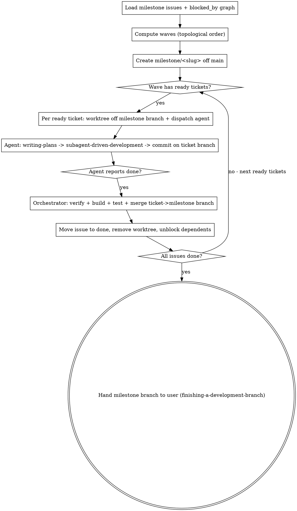

# Complete Milestone

## Overview

Orchestrate every issue in a cliban milestone to completion: one agent per ticket, run in dependency order, each isolated in its own worktree, each driven through `alex-skills:writing-plans` then `alex-skills:subagent-driven-development`. The orchestrator owns integration and merges; agents never merge.

**Core principle:** The orchestrator is a conductor, not a coder. It computes the dependency order, dispatches one agent per ticket, gates each ticket on its dependencies, and integrates finished work onto a milestone branch — never `main` — until the user finalizes.

**Announce at start:** "I'm using the complete-milestone skill to orchestrate `<milestone>`."

Requirement levels below: **MUST** = hard invariant; breaking it corrupts the milestone or `main`. **SHOULD** = default; override only with a stated reason. **MAY** = optional.

## When to Use

- "Orchestrate this milestone" / "complete the whole milestone" / "build out milestone X"
- A milestone has multiple issues with `blocked_by` relations forming an execution order
- You want each ticket planned and implemented independently, then integrated safely

**When NOT to use:** a single issue (use `alex-skills:writing-plans` + `alex-skills:subagent-driven-development` directly); issues with no shared integration target; exploratory work without a plan.

## The Integration Branch Rule (read first)

Ticket branches **MUST** merge into a milestone integration branch, never `main`.

Merging half-finished phases straight to `main` breaks whatever currently builds from `main` — often the very tool you are using to track the work. `main` stays shippable; the milestone branch absorbs the in-progress phases; the user lands it as one atomic switch at the end via `alex-skills:finishing-a-development-branch`.

```
main ──────────────────────────────────────●  (untouched until final cutover)
        │                                   ↑
        └─ milestone/<slug> ──●──●──●──●─────┘  (each ● = one ticket merged in)
                              │  │  │  │
                       .worktrees/<ticket-branch> per ticket
```

## Process



### Step 1: Load the milestone and its dependency graph

```bash
cliban issue ls --project <KEY> --milestone "<NAME>" --json
```

For each issue capture `key`, `status`, and `relations` (`blocked_by` targets). Build the DAG: an issue is **ready** when every issue it is `blocked_by` is `done`.

### Step 2: Compute waves

Topologically sort. A **wave** is the set of currently-ready, not-yet-done issues — they run in parallel. After a wave's issues land, recompute readiness; newly unblocked issues form the next wave. Announce the plan:

```
Waves: [PROJ-5] -> [PROJ-6, PROJ-8] -> [PROJ-7] -> [PROJ-9]
```

### Step 3: Create the milestone integration branch

```bash
ROOT=$(git rev-parse --show-toplevel)
SLUG=<milestone-slug>                       # e.g. rust-rewrite-loom-tui
git -C "$ROOT" branch "milestone/$SLUG" main 2>/dev/null || true
```

All ticket worktrees branch **off `milestone/$SLUG`**, not `main`.

### Step 4: Per ready ticket — worktree + one agent

For each ticket in the current wave, follow `alex-skills:using-git-worktrees` but branch off the milestone branch:

```bash
git worktree add "$ROOT/.worktrees/<ticket-branch>" -b "<ticket-branch>" "milestone/$SLUG"
```

Use the issue's `git_branch_name` as `<ticket-branch>`. Then dispatch **one agent per ticket** (parallel within a wave). Each ticket agent **MUST** be dispatched as `general-purpose` — it has to spawn its own implementer/reviewer subagents inside `subagent-driven-development`, which tool-restricted agent types (`Explore`, `Plan`) cannot do. The agent's brief **MUST**:

1. `cd` into its worktree and confirm isolation.
2. Invoke `alex-skills:writing-plans` for the issue key → fills the issue's `## Plan`.
3. Invoke `alex-skills:subagent-driven-development` for the same key → executes the plan task-by-task with the consolidated checkpoint review it mandates. The ticket agent is the **capable executor**: it stays on a capable model and fans out **cheap** per-task implementer subagents (reviewers stay capable) — see that skill's Model Selection. This is the intended planner→executor→cheap-implementer tiering, not a thing to flatten.
4. Commit all work on `<ticket-branch>`. **MUST NOT** merge, touch `main`, or touch the milestone branch.
5. Report back **only after every commit has landed** (commit-then-report; never report with staged-but-uncommitted work, never commit after reporting): final commit SHA, branch name, test status, one-line summary, and merge-risk notes.

The agent runs writing-plans AND subagent-driven-development itself — the orchestrator **MUST NOT** pre-plan for it.

### Step 5: Integrate as each agent finishes

When an agent reports done, the **orchestrator** (not the agent) integrates, following `alex-skills:finishing-a-development-branch` Option 1 but targeting the milestone branch. A "done" notification is a claim to verify, not a fact.

```bash
cd "$ROOT"
# 0. VERIFY THE AGENT ACTUALLY FINISHED (before trusting the report):
git -C ".worktrees/<ticket-branch>" log --oneline "milestone/$SLUG..<ticket-branch>"  # must have commits
git -C ".worktrees/<ticket-branch>" status -s                                          # staged-but-uncommitted = NOT done
#   Also confirm the cliban plan's task checkboxes are ticked. If work is staged/
#   uncommitted or tasks are open, the agent came to rest early — resume it
#   (SendMessage) to finish + commit; do NOT integrate a half-done branch.

git checkout "milestone/$SLUG"
git merge --no-ff "<ticket-branch>"         # resolve conflicts here, in the orchestrator
<build the project>                          # BUILD FIRST — see hazard 1 below
<run the project's test command>            # then the full test gate; milestone must stay green

# VERIFY THE MERGE CAPTURED THE BRANCH'S CURRENT TIP before cleanup (see hazard 2):
test "$(git rev-parse <ticket-branch>)" = "$(git rev-parse HEAD^2)" || echo "LATE COMMIT — agent committed after the merge snapshot; cherry-pick it in"

cliban issue mv <KEY> done
cliban issue log <KEY> "merged to milestone/$SLUG as $(git rev-parse --short HEAD)"
git worktree remove "$ROOT/.worktrees/<ticket-branch>"
git branch -d "<ticket-branch>" || git branch -D "<ticket-branch>"   # -d fails after conflict-resolved --no-ff; -D once verified merged
```

If the build or tests fail on the merge result, the ticket is not done — fix it in the orchestrator (the break is usually cross-ticket; see hazard 1) or reopen it before proceeding.

**Refresh dependents:** a ticket's worktree **MUST** branch off the *current* milestone branch, so create each worktree at wave time (after upstream merges), never all up front. Step 4 already does this.

### Step 6: Finalize

When every issue is `done` and `milestone/$SLUG` is green, STOP and hand off to the user via `alex-skills:finishing-a-development-branch` (base = `main`). Landing the milestone branch on `main` is the user's call — especially when a phase is a cutover that deletes or replaces existing code.

## Parallel-integration hazards

Wave tickets are written against the *same* base in parallel, so they collide on whatever is shared. The orchestrator is the **serialization point for every shared resource** — and the conflicts that matter most are the ones git does NOT mark.

**1. Clean auto-merge ≠ coherent code.** Two tickets that took divergent designs on the same files auto-merge with *zero conflict markers* yet produce a tree that doesn't compile — git merged non-overlapping hunks of incompatible designs. **Build after every merge, even marker-free ones.** The compiler is the authority; git silence is not. The fix is usually porting an *already-merged* ticket's code onto the newer ticket's API (delegate that to a focused agent if it's deep), not reverting.

**2. Agents commit after they report.** An agent (or a sub-agent it spawned) can push a commit *after* its "done" notification / after your merge snapshot. Verify `git rev-parse <branch>` equals the merge's ticket-side parent (`HEAD^2`) before deleting the branch; cherry-pick any straggler.

**3. Serialized shared sequences (changelog IDs, version files, shared enums, registries).** Every agent mints the next ID / bumps the version against the *stale* base, so they collide on merge. Pre-assigning reserved IDs in briefs helps but merge-order still wins — **the orchestrator owns the sequence and renumbers at integration time**, in merge order, keeping it gapless. Tell agents not to bump a shared version file at all (the milestone is one unreleased version until finalize).

**4. Path-based pre-commit hooks don't enforce *completeness*.** A spec-first (or lint, or codegen) hook that fires on "any file under X changed" passes when an agent does *half* the paired change — adds the section but not the changelog entry, the keyword but not the grammar. The orchestrator must check the both-halves invariant at integration and fill the gap.

**5. Shared mutable state contention.** Sub-agents racing on a shared DB/scratchpad (e.g. the cliban issue store) can overwrite each other's ticket descriptions or files. Verify each ticket's description still matches its key before relying on it; keep per-ticket state in the worktree, not shared paths.

**6. Finished agents re-create branches/worktrees.** An agent doing a late rebase can resurrect a branch/worktree you already cleaned up. Re-scan `git worktree list` for stragglers before finalizing; remove stale ones (`--force` if needed) — but never the *live* worktree of a still-running agent.

## Rules

The whole skill, graded. Each rule appears once.

| Level | Rule | What it prevents |
|---|---|---|
| **MUST** | Merge ticket branches into `milestone/<slug>`, never `main` until the user finalizes | Breaking the working build mid-milestone |
| **MUST** | Build the dependency DAG first; dispatch a ticket only after all its `blocked_by` are `done` | Dependents racing their dependencies against stale code |
| **MUST** | The orchestrator integrates; agents never merge, rebase onto, or push the milestone branch | Losing the orchestrator's conflict-resolution + green-tests gate |
| **MUST** | Build *then* test on every merge result, even marker-free auto-merges; a failure reopens the ticket | A clean auto-merge of two divergent designs that compiles to nothing (hazard 1) |
| **MUST** | Treat "done" as a claim: verify real commits + ticked plan + `<branch>` == merge `HEAD^2` before cleanup; cherry-pick stragglers | Integrating a half-done branch / deleting a branch whose late commits never merged (hazard 2) |
| **MUST** | The orchestrator owns every shared sequence (changelog IDs, version files, shared enums); renumber at merge, in order, gapless | Guaranteed collisions when each agent mints against a stale base (hazard 3) |
| **MUST** | Hand the final milestone-branch → `main` decision to the user | An agent or orchestrator silently shipping a cutover the user hasn't approved |
| **MUST NOT** | Pre-plan a ticket for its agent — the agent runs writing-plans then subagent-driven-development itself | Losing the per-ticket plan + review checkpoints that happen inside the agent |
| **SHOULD** | Create each worktree at wave time, off the current milestone branch | Dependent tickets branching off code that lacks their dependency's work |
| **SHOULD** | Dispatch each ticket agent as `general-purpose` | A tool-restricted agent that cannot spawn its own implementer/reviewer subagents |
| **SHOULD** | Brief every agent: commit everything first, THEN report — no dangling commits | The integrator silently missing a commit that arrives after the report (hazard 2) |
| **SHOULD** | Check the both-halves invariant when a path-based hook could pass on a half-done paired change | A completeness gap a per-file hook can't catch (hazard 4) |
| **SHOULD** | Re-scan `git worktree list` for stragglers before finalizing; never remove a live agent's worktree | A late rebase resurrecting a branch/worktree you already cleaned up (hazard 6) |
