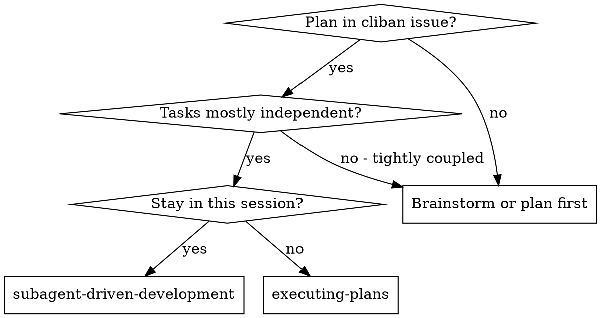

# Subagent-Driven Development

Execute a plan by dispatching a fresh subagent per task, with a consolidated **dual-verdict review at each plan-defined checkpoint** — not after every task. The plan lives in a cliban Issue's `## Plan` section and marks its own review checkpoints (placed by writing-plans at logical boundaries).

**Why subagents:** You delegate tasks to specialized agents with isolated context. By precisely crafting their instructions and context, you ensure they stay focused and succeed. They should never inherit your session's context or history — you construct exactly what they need. This also preserves your own context for coordination work.

**Core principle:** Fresh subagent per task + one dual-verdict review per checkpoint (spec + quality together, over the diff since the last checkpoint) = high quality without the per-task review tax. Reviewing after every task is what slows tickets down; the plan's checkpoints batch it at the right boundaries.

**Continuous execution:** Do not pause to check in between tasks. Execute all tasks from the plan without stopping. The only reasons to stop are: BLOCKED status you cannot resolve, ambiguity that prevents progress, or all tasks complete.

**Commit discipline (continuous ≠ uncommitted):** Land every task's work as a commit *as you go*. Commits are the only durable, reviewable record — staged-but-uncommitted work is invisible to reviewers and to whoever integrates the branch, and a subagent can end its turn with work merely staged. So: never advance past a task, come to rest, or send your final report while any task's work is staged-but-uncommitted; verify each task's commit actually landed (`git log --oneline <base>..HEAD`) before moving on; and **never commit anything after your final report** — land every commit first, *then* report. A commit that arrives after your report gets silently missed by the integrator.

## When to Use



## The Process

### Step 0: Enforce Worktree Isolation

Plan execution requires an isolated worktree — there is **no fallback to in-place work**. Before reading the plan or touching any task:

1. Invoke `alex-skills:using-git-worktrees`.
2. After it returns, verify isolation actually succeeded:

   ```bash
   GIT_DIR=$(cd "$(git rev-parse --git-dir)" 2>/dev/null && pwd -P)
   GIT_COMMON=$(cd "$(git rev-parse --git-common-dir)" 2>/dev/null && pwd -P)
   if [ "$GIT_DIR" = "$GIT_COMMON" ] && [ -z "$(git rev-parse --show-superproject-working-tree 2>/dev/null)" ]; then
     echo "ABORT: not in a worktree" >&2; exit 1
   fi
   ```

3. **If the check fails** (e.g., sandbox blocked `git worktree add` and the worktree skill fell back to in-place), STOP. Report the failure and ask the user to resolve permissions or use a less-restrictive sandbox before retrying. Do not proceed with the plan in the main checkout. The in-place fallback in `using-git-worktrees` is for ad-hoc work, not for executing a written plan.

### Step 1: Load Plan from Cliban

1. Resolve the issue key (argument, `cliban issue current --json`, or ask user).
2. Read the plan section:

```bash
cliban issue show <KEY> --section plan
```

3. Extract every task with full text, **and note the `### Review Checkpoint: <scope>` markers** — they sit between task groups and tell you where to review. The plan format is binding per the `cliban-workflow` description contract:
   - H3 `### Task N: <name>` headers separate tasks
   - H3 `### Review Checkpoint: <scope>` markers separate review groups (not tasks — never dispatch an implementer for one)
   - GFM `- [ ]` / `- [x]` lines are the steps
   - If a plan has no checkpoint markers (older plans), treat the end of the plan as the single checkpoint.
4. Critically review for gaps or contradictions. Surface concerns to the user before dispatching.
5. Create a TodoWrite with one todo per Task (NOT per Step — steps are bite-sized, internal to the subagent).

### Step 2: Move Issue to In-Progress

```bash
cliban issue mv <KEY> in-progress
cliban issue log <KEY> "starting subagent-driven execution"
```

### Step 3: Per-Task Loop

For each Task N in the plan:

#### 3a. Dispatch Implementer Subagent

Use the template `./implementer-prompt.md` with these fields filled in:
- `WHAT_TO_BUILD`: the full task text (read from your extraction in Step 1)
- `CLIBAN_KEY`: `<KEY>` so the subagent can call `cliban issue tick`/`log` itself
- `TASK_NUMBER`: N
- `CONTEXT`: scene-setting — what already shipped (previous tasks done), what depends on this task

The subagent must:
1. Implement the task
2. Run tests
3. Commit (one or more commits per task, depending on scope)
4. Tick each step via `cliban issue tick <KEY> --task N --step M` as it goes
5. Self-review
6. Report back with status

**Blocking dispatch — consume the return value, don't fire-and-forget.** Dispatch the implementer and wait for it; read the result it *returns* to you. Do NOT background-dispatch task subagents, and do NOT design a flow where a task subagent must message you back after you've moved on — a child that reports to a parent who has already advanced or finished is orphaned (the "peer no longer addressable" failure, and the source of dropped commits). One task child is live at a time; you do not advance to the next task, and you do not emit your own final report, while any dispatched child is still running or its commit is unlanded. If a child returns with work staged-but-uncommitted, YOU commit it (you have the worktree) before proceeding.

#### 3b. Handle Implementer Status

**DONE:** mark the task complete (3c) and move to the next plan item.
**DONE_WITH_CONCERNS:** read concerns. If about correctness/scope, address before continuing. Otherwise note and proceed.
**NEEDS_CONTEXT:** provide missing context and re-dispatch.
**BLOCKED:** assess the blocker. Context problem → provide context and retry. Reasoning problem → re-dispatch with a more capable model. Task too big → break it down. Plan wrong → escalate to user.

There is **no independent review here** — the implementer self-reviews (3a), and independent review happens at the next checkpoint (3d). What you DO verify per task: the commit landed (`git log --oneline <base>..HEAD`) and the implementer's tests passed.

#### 3c. Mark Task Complete + Log

```bash
cliban issue log <KEY> "Task N complete: <one-line summary>"
```

Update TodoWrite — Task N done. Then continue to the next plan item.

#### 3d. At a Review Checkpoint — Dispatch the Dual-Verdict Reviewer

When the next plan item is a `### Review Checkpoint: <scope>` marker (or you've reached the end of the plan), review the whole group of tasks completed since the previous checkpoint in **one** dispatch:

1. Use `./task-reviewer-prompt.md`. Set `BASE_SHA` = HEAD recorded at the previous checkpoint (branch base for the first checkpoint), `HEAD_SHA` = current HEAD. Pass the full text of every task in the group + their implementer reports.
2. The reviewer returns **two verdicts**: spec compliance (per task) and code quality (Critical/Important/Minor over the group's diff).
3. **Act:** any spec ❌ or any Critical/Important quality issue → re-dispatch the relevant implementer with specifics, then re-review the checkpoint. Only Minor → accept; `cliban issue log` if they accumulate.
4. Record current HEAD as the base for the next checkpoint, then continue the loop.

This is the consolidation point: N tasks cost **one** review at their checkpoint, not 2N. Checkpoints are placed in the plan (by writing-plans) at boundaries where a bug would otherwise compound — notably before later tasks stack on a foundational slice.

### Step 4: Final Cumulative Review

After all tasks are done:

1. Dispatch a final code reviewer for the entire body of work (cumulative diff).
2. The reviewer evaluates cross-checkpoint consistency, architectural drift, dead code, anything that slipped between checkpoint reviews. (Lighter now — most issues were caught at checkpoints; this is the backstop.)
3. **Ponytail drift check:** the same reviewer also confirms the implementation didn't over-build *beyond* the lazy plan — no abstractions, dependencies, or flexibility the plan didn't call for. The plan was already trimmed by ponytail at write time; this verifies the executor stayed within it rather than re-trimming the plan. Have the reviewer apply the `alex-skills:ponytail-review` lens to the cumulative diff for this. One pass, cumulative — not per task.
4. Report findings to user.
5. If Critical/Important issues found, dispatch fix subagent(s).

### Step 5: Finishing

After cumulative review approves:

- Announce: "I'm using the finishing-a-development-branch skill to complete this work."
- **REQUIRED SUB-SKILL:** Use `alex-skills:finishing-a-development-branch`.

## Model Selection

**Role tiering — preserve the judgment and execution responsibilities.** You (the executor) coordinate, resolve conflicts, run reviews, and land commits. Per-task implementers do the grind; reviewers independently recover quality. Always request the correct semantic role. A selected profile may intentionally map several roles to the same concrete model; do not reject or override that mapping, and do not substitute the `mechanical` role merely to save tokens.

Resolve concrete model identifiers through model-routing:
- **Executor (you):** inherit the session model. Ticket agents spawned by a milestone use `coordinator`.
- **Checkpoint + final reviewers:** use `reviewer`. This is the quality-recovery layer for cheaper implementers.
- Per-task **implementer** model, by task shape:
  - **Mechanical tasks** (isolated functions, clear specs, 1-2 files): `mechanical`
  - **Integration tasks** (multi-file coordination, debugging): `implementer`
  - **Architecture-heavy tasks** (cross-cutting design, gnarly refactors): `coordinator`

## Prompt Templates

- `./implementer-prompt.md` — implementer subagent (one per task)
- `./task-reviewer-prompt.md` — dual-verdict checkpoint reviewer (one per `### Review Checkpoint`)

Adjust these to include the `cliban issue tick` / `cliban issue log` calls the subagent should make. The subagent works on a single Task at a time; it does NOT mutate the plan structure (no edits to the `## Plan` section directly — only `tick` and `log` and `promote`).

## Red Flags

**Never:**
- Start implementation without a verified worktree (Step 0 — the in-place fallback in `using-git-worktrees` is for ad-hoc work, not plan execution)
- Start implementation on `main`/`master` without explicit user consent
- Skip a checkpoint review, or review each task independently instead of batching to the plan's checkpoints
- Proceed past a checkpoint with unfixed spec ❌ or Critical/Important issues
- Dispatch multiple implementer subagents in parallel (conflicts)
- Make a subagent read the plan from cliban directly — extract the task text once and pass it as part of the prompt (reduces subagent context cost, prevents re-reads from drifting)
- Let a subagent edit the `## Plan` or `## Spec` structure — they can `tick`, `log`, `promote`, but NOT `edit --description`
- Report a task or the whole plan "done" while any work is staged-but-uncommitted
- Commit anything after your final report — land every commit first, THEN report
- Come to rest while a dispatched subagent's task work is uncommitted or unverified — a subagent can end its turn with work merely staged, or become unaddressable mid-task; YOU land/verify the commit before advancing
- Background-dispatch task subagents or rely on a child messaging you back — dispatch blocking and consume the returned result; a child reporting to a parent who has moved on is orphaned

**Always:**
- Pass the FULL task text in the subagent prompt (not the issue key + "read the plan")
- Set `CLIBAN_KEY` so the subagent can call tick/log
- Review the subagent's commits (not just its report) — commits are the ground truth
- Verify each task's commit actually landed on the branch (`git log --oneline <base>..HEAD`) before advancing to the next task

## Integration

**Required workflow skills:**
- `alex-skills:using-git-worktrees` — ensure isolated workspace
- `alex-skills:writing-plans` — creates the plan
- `alex-skills:requesting-code-review` — review templates
- `alex-skills:finishing-a-development-branch` — complete development

**Subagents should use:**
- `alex-skills:test-driven-development` — TDD per task
